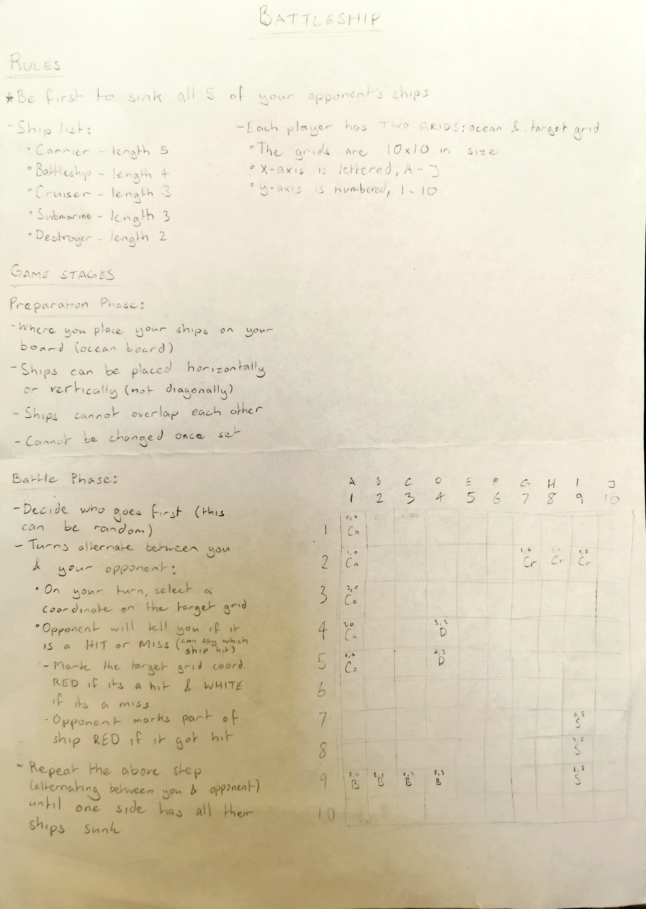
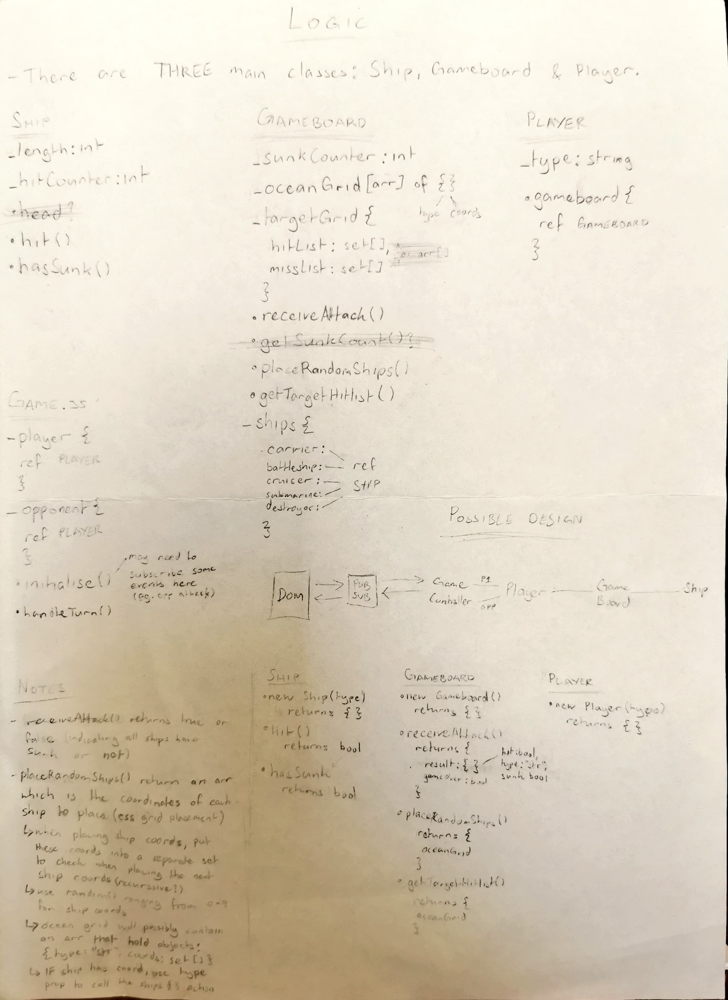

# battleship

This repository contains a simple implementation of the battleship game.

## Technologies Used

- HTML
- CSS
- JavaScript
- Webpack
- Jest
- Babel

## Installation

1. **Clone the repository**:

   ```bash
   git clone https://github.com/ishmyles/battleship.git
   cd battleship
   ```

2. **Install dependencies**:

   ```bash
   npm install
   ```

3. **Run tests**:

   ```bash
   npm test
   ```

4. **Start the application**:

   ```bash
   npm start
   ```

   The app will open a browser window - can also be accessible at `http://localhost:8080`.

5. **Terminating the app**:

   Press Ctrl + C to terminate app.

## App Design



